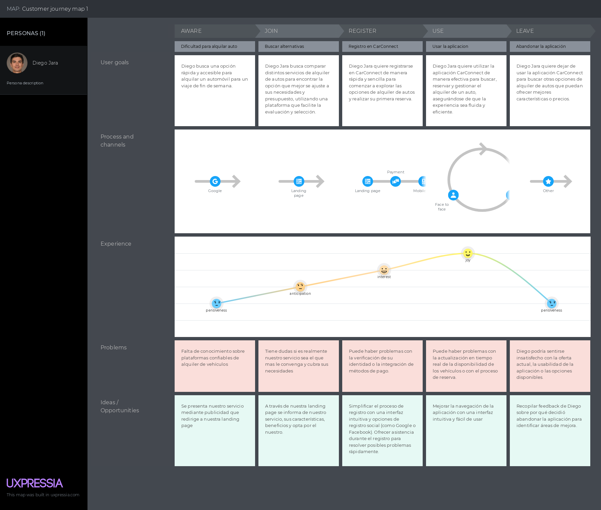
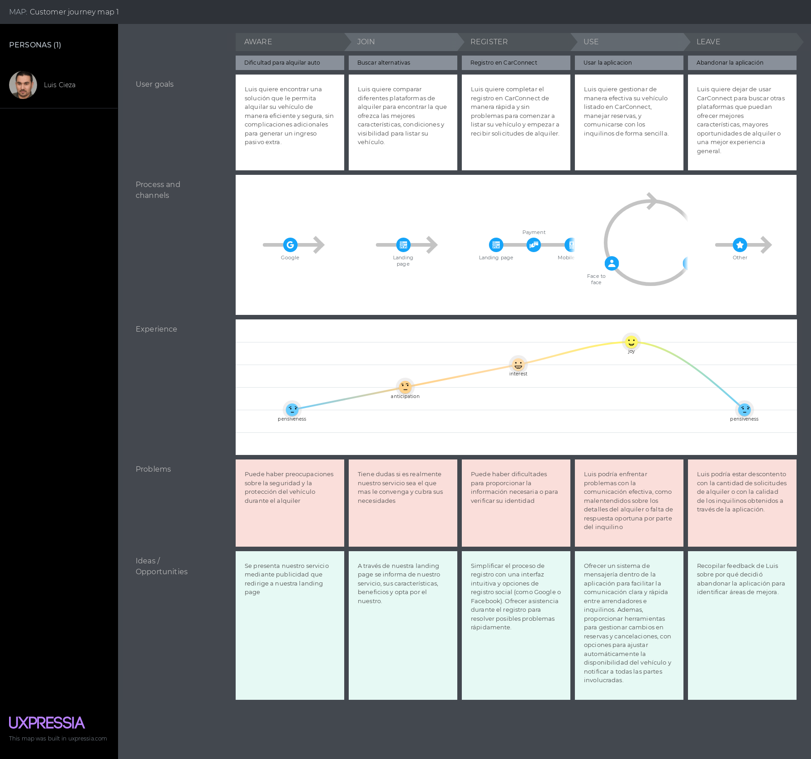
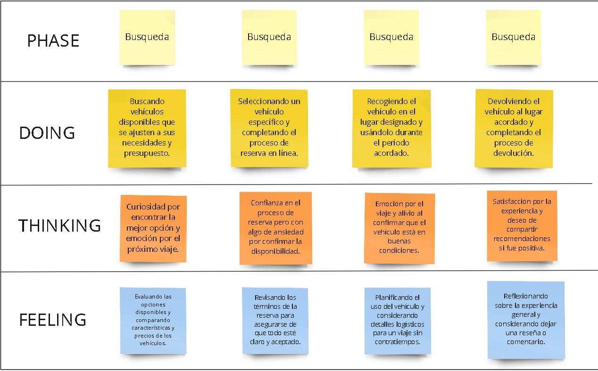

Universidad Peruana de Ciencias Aplicadas

Carrera: Ingeniería de Software

Ciclo: 2024-02

Curso: Aplicaciones para Dispositivos Móviles

Sección: WS64

Profesor: Eduardo Martin Reyes Rodriguez

Informe del Trabajo 

Startup: CarConnect

Producto: DriveNow

Integrantes:

- Integrante 1: Luiggi Jeremy Antonio Loayza
- Integrante 2: Andrea Joselyn Garcia Moscoso
- Integrante 3: Nombre y Apellido
- Integrante 4: Carlos Andres Rojas Ccama
- Integrante 5: Scott Jacobo Huachaca Advincula

# Contenido

## Tabla de contenidos

### [Capítulo I: Introducción]()

- [1.1. Startup Profile]()
    - [1.1.1 Descripción de la Startup]()
    - [1.1.2 Perfiles de integrantes del equipo]()
- [1.2 Solution Profile]()
    - [1.2.1 Antecedentes y problemática]()
    - [1.2.2 Lean UX Process]()
        - [1.2.2.1. Lean UX Problem Statements]()
        - [1.2.2.2. Lean UX Assumptions]()
        - [1.2.2.3. Lean UX Hypothesis Statements]()
        - [1.2.2.4. Lean UX Canvas]()
- [1.3. Segmentos objetivo]()

### [Capítulo II: Requirements Elicitation & Analysis]()

- [2.1. Competidores]()
    - [2.1.1. Análisis competitivo]()
    - [2.1.2. Estrategias y tácticas frente a competidores]()
- [2.2. Entrevistas]()
    - [2.2.1. Diseño de entrevistas]()
    - [2.2.2. Registro de entrevistas]()
    - [2.2.3. Análisis de entrevistas]()
- [2.3. Needfinding]()
    - [2.3.1. User Personas]()
    - [2.3.2. User Task Matrix]()
    - [2.3.3. User Journey Mapping]()
    - [2.3.4. Empathy Mapping]()
    - [2.3.5. As-is Scenario Mapping]()
- [2.4. Ubiquitous Language]()

# Student Outcome

| Criterio Específico | AccionesRealizadas | Conclusiones |
|---------------------|--------------------|--------------|
| Actualiza conceptos y conocimientos necesario para su desarrollo profesional y en especial para su proyecto en soluciones de software |  **TB1**  | **TB1**|
| Reconoce la necesidad del aprendizaje permanente para el desempeño profesional y el desarrollo de proyectos en soluciones de software |  **TB1**  | **TB1** |

# Capítulo I: Introducción

## 1.1 Startup Profile

### 1.1.1 Descripción de la Startup

CarConnect es una startup que busca facilitar el proceso de alquiler de vehículos a través de una aplicación móvil intuitiva. Nuestra plataforma permite a los usuarios registrarse, buscar y alquilar autos de manera eficiente. Ofrecemos funcionalidades clave como la creación de cuentas tanto para arrendatarios como para propietarios, la visualización de autos disponibles según ubicación, la gestión de solicitudes de alquiler, y la actualización de datos personales. Además, los propietarios pueden registrar el mantenimiento de sus vehículos, lo que permite a los arrendatarios consultar el estado del auto antes de alquilarlo.

Nos comprometemos a proporcionar una experiencia de usuario sencilla y accesible, centrada en resolver las necesidades específicas de nuestros clientes, desde la búsqueda inicial hasta la finalización del contrato de alquiler.

**Misión**

- Nuestra misión es simplificar y mejorar el proceso de alquiler de vehículos, tanto para quienes alquilan como para quienes ofrecen sus autos en alquiler, a través de una plataforma intuitiva y confiable.

**Visión**

- Nuestra visión es consolidarnos como la aplicación de alquiler de autos preferida en Lima Metropolitana, reconocida por su facilidad de uso y servicio al cliente. A largo plazo, aspiramos a expandirnos a otras regiones del país, ofreciendo nuestras soluciones a un público más amplio.

### 1.1.2 Perfiles de integrantes del equipo

| Integrante                      | Foto                                                                                                                                       | Descripción del Perfil                                                                                                                                                                                                                                                                                                                                                               |
|---------------------------------|--------------------------------------------------------------------------------------------------------------------------------------------|--------------------------------------------------------------------------------------------------------------------------------------------------------------------------------------------------------------------------------------------------------------------------------------------------------------------------------------------------------------------------------------|
| Jeremy Antonio Loayza           |  | Mi nombre es Luiggi Jeremy Antonio Loayza y soy un estudiante de Ingeniería de Software con una fuerte inclinación hacia el liderazgo y la organización de equipos, destacándome por mi participación activa y proactiva en proyectos. Mi enfoque colaborativo me permite asignar tareas de manera eficiente y motivar a mis compañeros, mientras que mis habilidades técnicas en herramientas como Figma, Adobe XD, HTML y CSS respaldan mi capacidad para materializar ideas. Busco constantemente oportunidades de crecimiento y aprendizaje, y estoy comprometido con impulsar la innovación y el éxito en cualquier entorno de desarrollo de software. |
| Carlos Andres Rojas Ccama       |  | Mi nombre es Carlos Rojas, estudio la carrera de Ingeniería de Software. Mi carrera consiste en crear softwares y sistemas informáticos usando un lenguaje de programación con lógica. Me considero una persona responsable y colaborativo y dar ideas, especialmente en grupos. En este trabajo en equipo se requiere dar una buena comunicación, por ello, siempre daré mi opinión. |
| Andrea Joselyn Garcia Moscoso   |                                                                        | Actualmente estoy cursando el sexto ciclo de mi carrera. Elegí esta carrera debido a que desde la niñez me interesó el cómo funcionan las computadoras por dentro. Poseo conocimiento en programación estructurada, POO, bases de datos, frontend y backend. Además, tengo habilidades en el trabajo en equipo y trabajo en tareas múltiples.                                        |
| Scott Jacobo Huachaca Advincula |                                                           | Soy estudiante de la UPC, la razón por la que elegí la carrera es porque combina las cosas que me gustan como la tecnologia y la creacion de aplicaciones. Ademas siempre me ha intrigado como funcionan las aplicaciones que utilizamos a diario, como las redes sociales o aplicaciones de productividad.             
| Sebastian Valente Lobato Pozo   |                                                                   | Soy un estudiante de la carrera de Ingenieria de Software de la UPC, me me encuentro en ell sexto ciclo. Escogi esta carrera debido que desde niño siempre tenia mucha curiosidad sobre como funcionan las computadoras y videojuegos. Tengo conocimiento en el desarollo de aplicaciones en C++, LUA, Python, así como HTML, CSS, uso de frameworks como React, Angular, Vue y conocimiento de backend, base de datos, etc. Me considero una persona amable, responsable y colaborativa.   |

## 1.2 Solution Profile

### 1.2.1 Antecedentes y problemática

What? - ¿Qué?
¿Cuál es el problema?

El problema que CarConnect busca resolver es la dificultad y las limitaciones que enfrentan las personas al alquilar vehículos de manera tradicional. Muchos consumidores encuentran el proceso de alquilar un auto lento, caro, y limitado a las opciones disponibles en agencias de alquiler tradicionales. Además, los propietarios de vehículos tienen vehículos que no utilizan todo el tiempo, lo que representa un recurso subutilizado.

When? - ¿Cuándo?
¿Cuando ocurre el problema?

El problema ocurre cuando las personas necesitan alquilar un vehículo de manera rápida y conveniente, pero se encuentran con procesos tradicionales que son engorrosos, costosos, etc. También surge cuando los propietarios de vehículos tienen automóviles que no están siendo utilizados, resultando en un recurso desperdiciado que podría generar ingresos adicionales. 

Where? - ¿Dónde?
¿Dónde se tomarán las medidas?

Las medidas se tomarán en Lima Metropolitana, implementando la solución a través de la aplicación móvil CarConnect.

Who? - ¿Quién?
¿Quién lo utilizará? ¿Quién es el cliente de este producto?

El cliente de CarConnect incluye a los arrendatarios, que son personas que buscan alquilar un vehículo de manera rápida y conveniente, y a los arrendadores, que son propietarios de vehículos que desean rentar sus autos cuando no los están utilizando, incluyendo aquellos interesados en utilizar sus vehículos para servicios de transporte o taxi.

Why? - ¿Por qué?
¿Por qué es necesario resolver este problema?

Es necesario resolver este problema porque los métodos tradicionales de alquiler de vehículos suelen ser ineficientes y limitan las opciones disponibles para los usuarios. Además, muchos propietarios tienen vehículos que no utilizan, lo que representa una oportunidad perdida para generar ingresos adicionales. CarConnect ofrece una solución más flexible y accesible, beneficiando tanto a quienes necesitan alquilar un vehículo como a quienes desean rentar el suyo. Esto mejora la utilización de los recursos y facilita el acceso a vehículos en momentos de alta demanda o necesidades urgentes.

How? - ¿Cómo?
¿Cómo se resolverá el problema?

El problema se resolverá mediante la implementación de la aplicación móvil CarConnect, que conectará a arrendatarios y arrendadores de manera directa. La plataforma permitirá a los usuarios buscar y alquilar vehículos fácilmente, mientras que los propietarios podrán listar sus autos para renta.

How much? - ¿Cuánto?
¿Cuánto costará resolver el problema?

El desarrollo de esta solución puede ser costoso, tanto en términos financieros como en tiempo y esfuerzo. Por ejemplo, una garantía no reembolsada puede provocar una pérdida considerable para un arrendatario. Por eso, es crucial contar con una plataforma confiable que reduzca estos riesgos para ambas partes en el proceso de alquiler de vehículos.

### 1.2.2 Lean UX Process

#### 1.2.2.1. Lean UX Problem Statements

En el mercado actual de alquiler de autos, tanto los arrendatarios como los propietarios enfrentan desafíos significativos que minan la confianza en el proceso. Estos incluyen fallas mecánicas inesperadas, casos de fraude, y una falta general de transparencia y seguridad. Estos problemas no solo afectan la experiencia del usuario, sino que también limitan el crecimiento del sector.

Problema: La ausencia de sistemas efectivos de seguridad y transparencia en el proceso de alquiler de autos genera incertidumbre y preocupación tanto en los arrendatarios como en los propietarios. Los arrendatarios están preocupados por el estado mecánico de los vehículos y la posibilidad de fraudes, mientras que los propietarios temen el mal uso de sus vehículos y la falta de control sobre el proceso de alquiler.

Impacto en el Negocio: Esta falta de confianza ha resultado en una menor adopción de servicios de alquiler de autos, reduciendo el crecimiento potencial del mercado. Los usuarios descontentos no solo afectan la reputación de las empresas, sino que también resultan en una menor retención de clientes y una disminución en las ventas.

Hipótesis: Creemos que al desarrollar una solución que incremente la seguridad y la transparencia en el proceso de alquiler de autos, podremos reducir significativamente los riesgos asociados con fallas mecánicas y fraudes. Esto, a su vez, mejorará la confianza y satisfacción de los usuarios, aumentando tanto la adopción del servicio como la retención de clientes.

Visión: Nuestra visión es revolucionar el mercado de alquiler de autos, creando una plataforma que priorice la seguridad y la transparencia, lo que generará una mayor confianza y satisfacción entre arrendatarios y propietarios.

Objetivo: Desarrollar una plataforma que incorpore mecanismos avanzados de seguridad y transparencia en el alquiler de autos, con el fin de minimizar los riesgos y maximizar la confianza y satisfacción de los usuarios, impulsando así el crecimiento del mercado.

#### 1.2.2.2 Lean UX Assumptions

##### Business Assumptions:
- **Creemos que** nuestros usuarios necesitan una plataforma confiable y eficiente para alquilar vehículos, brindando seguridad y transparencia durante todo el proceso.
- **Estas necesidades** se pueden satisfacer con una aplicación web/móvil que ofrezca una interfaz intuitiva, transparencia en tarifas y contratos, una amplia selección de vehículos, y un sistema de calificación y reseñas para garantizar la calidad del servicio.
- **Nuestros clientes** serán personas mayores de 20 años con licencia de conducir que buscan alquileres seguros y propietarios de vehículos interesados en alquilarlos de manera confiable.
- **El valor más importante** que un cliente busca es la seguridad y facilidad de uso durante el proceso de alquiler, junto con el acceso a una amplia gama de vehículos.
- **El cliente también** obtendrá beneficios como contratos claros, una variedad de opciones de vehículos, y la posibilidad de leer y dejar reseñas para garantizar un servicio de calidad.
- **Vamos a atraer** a la mayoría de nuestros clientes mediante estrategias de marketing digital enfocadas en la experiencia del usuario, destacando la transparencia y conveniencia de nuestra plataforma.
- **Generaremos ingresos** mediante comisiones sobre las transacciones en la plataforma y planes de membresía para usuarios que busquen beneficios adicionales como seguros ampliados o tarifas reducidas.
- **Nuestra competencia principal** será otras plataformas de alquiler entre particulares y servicios de alquiler tradicionales.
- **Tendremos ventaja** sobre la competencia gracias a nuestra transparencia en tarifas y contratos, la variedad de vehículos disponibles, y nuestro enfoque en la facilidad de uso y satisfacción del cliente.
- **El mayor riesgo** es la resistencia de los usuarios y propietarios a adoptar nuestra plataforma debido a la preferencia por métodos tradicionales de alquiler.
- **Lo resolveremos** ofreciendo una interfaz fácil de usar, clara y transparente, junto con un soporte al cliente excepcional para guiar a los usuarios en el proceso.

##### User Assumptions:
- **¿Quién es el usuario?** Los principales usuarios de nuestro producto son personas mayores de 20 años con licencia de conducir que buscan alquilar vehículos de manera segura, y propietarios de vehículos interesados en generar ingresos adicionales alquilando sus autos de forma segura.
- **¿Qué problemas tiene nuestro producto? ¿Resolver?** Nuestro producto actualmente no proporciona suficiente claridad en los costos asociados al alquiler, lo que puede causar frustración en los usuarios al enfrentar cargos inesperados.
- **¿Qué características son importantes?** Es crucial que nuestra aplicación ofrezca una descripción clara y detallada de todos los costos asociados al alquiler, incluyendo tarifas, seguros y cualquier cargo adicional, además de un sistema de inspección fácil y eficiente antes y después del alquiler.
- **¿Dónde encaja nuestro producto en su trabajo o vida?** El producto se integra en la rutina diaria de los usuarios al proporcionar un método más seguro y conveniente para alquilar vehículos, reemplazando las opciones tradicionales como el transporte público o la compra de un auto propio.
- **¿Cuándo y cómo es nuestro producto usado?** El producto es utilizado principalmente cuando los usuarios necesitan un vehículo para viajes cortos o largos, y prefieren alquilar en lugar de poseer un auto, pudiendo acceder a la plataforma desde su celular o computadora.
- **¿Cómo debe verse nuestro producto y cómo debe comportarse?** El diseño del producto debe ser intuitivo y confiable, con una interfaz gráfica que facilite la navegación y proporcione información clara sobre el estado del alquiler, las opciones de seguro y los costos asociados, todo ello sin causar confusiones o errores.

##### Feature Assumptions:
- **Claridad de Costos y Tarifas**
    - **Hipótesis:** Creemos que proporcionar una descripción clara y detallada de todos los costos asociados al alquiler (tarifas, seguros, cargos adicionales) aumentará la confianza del usuario en la plataforma y reducirá la frustración causada por cargos inesperados.
    - **Experimento:** Realizaremos un A/B testing presentando dos versiones de la aplicación: una que muestre todos los costos de manera detallada y otra con información más básica. Mediremos cuál versión reduce la cantidad de quejas y genera mayor satisfacción entre los usuarios, basándonos en métricas como la cantidad de tickets de soporte relacionados con costos y las calificaciones de satisfacción del usuario.

- **Sistema de Inspección Eficiente**
    - **Hipótesis:** Creemos que proporcionar guías claras y recomendaciones para la inspección del vehículo, tanto antes como después del alquiler, incrementará la confianza en la plataforma y reducirá los conflictos entre arrendadores y arrendatarios.
    - **Experimento:** Realizaremos un A/B testing donde un grupo de usuarios recibirá guías detalladas de inspección mientras que otro grupo no. Compararemos la cantidad de disputas o reclamaciones relacionadas con el estado del vehículo entre ambos grupos para medir el impacto de estas guías en la reducción de conflictos.

- **Transparencia en Contratos de Alquiler**
  - **Hipótesis:** Creemos que ofrecer contratos de alquiler claros y detallados que cumplan con las leyes locales aumentará la confianza del usuario en la plataforma y su disposición a utilizarla repetidamente.
  - **Experimento:** Implementaremos una versión actualizada del contrato con términos claros y detallados en toda la plataforma y recopilaremos feedback de los usuarios a través de encuestas de satisfacción. Compararemos estos resultados con periodos anteriores para evaluar el impacto de la mayor transparencia en la retención de usuarios y la reducción de disputas.

- **Soporte al Cliente**
  - **Hipótesis:** Creemos que ofrecer herramientas de autoayuda y recursos de soporte automatizados, como una base de conocimiento completa y un chatbot disponible 24/7, incrementará la satisfacción del usuario y fomentará la lealtad a la plataforma.
  - **Experimento:** Implementaremos un chatbot y una base de conocimiento dentro de la plataforma, y mediremos la satisfacción del usuario a través de encuestas y la reducción en el número de solicitudes de soporte. Compararemos estos resultados con periodos anteriores donde estos recursos no estaban disponibles para evaluar su efectividad.

#### 1.2.2.3 Lean UX Hypothesis Statements

- **Hypothesis Statement 01:**
  - **Creemos que** la plataforma se convertirá en el medio principal para que los usuarios alquilen vehículos de manera segura y eficiente.
  - **Sabremos que hemos tenido éxito** cuando al menos el 60% de los usuarios que inicien el proceso de alquiler en nuestra plataforma lo completen con éxito durante un periodo de tres meses consecutivos, y cuando veamos un incremento constante en las recomendaciones positivas dentro de la plataforma.

- **Hypothesis Statement 02:**
  - **Creemos que** la plataforma será reconocida como un sitio confiable para que los usuarios alquilen vehículos con total transparencia y seguridad.
  - **Sabremos que hemos tenido éxito** cuando más del 70% de las calificaciones recibidas en la plataforma sean de al menos 4 estrellas sobre 5 en aspectos de seguridad, transparencia y satisfacción general.

- **Hypothesis Statement 03:**
  - **Creemos que** los usuarios que alquilan vehículos de manera frecuente valorarán las características y beneficios adicionales ofrecidos por la plataforma.
  - **Sabremos que hemos tenido éxito** cuando más del 50% de los usuarios que han realizado más de un alquiler en los últimos seis meses continúen utilizando la plataforma regularmente, indicando una percepción positiva del valor y la experiencia de uso.

- **Hypothesis Statement 04:**
  - **Creemos que** las comisiones aplicadas en las transacciones no serán un impedimento para que los propietarios de vehículos utilicen nuestra plataforma.
  - **Sabremos que hemos tenido éxito** cuando el 80% de los propietarios que han realizado al menos tres alquileres a través de la plataforma en el último año continúen utilizándola, a pesar de las tarifas de comisión, indicando su aceptación del valor proporcionado.

## 1.3 Segmentos objetivo

- La plataforma está direccionada a dos segmentos objetivos, personas mayores de 20 años: Personas con licencia de conducir interesados en buscar automóviles, y personas que tengan un vehículo legalmente registrado y documentado, que deseen alquilarlo. A continuación, se describe a cada uno de ellos:

**Se identificaron dos  segmentos objetivos:**

**Personas que buscan Alquilar Vehículos (Arrendatarios)**

- Este segmento está compuesto por individuos mayores de 20 años que poseen una licencia de conducir y están interesados en alquilar vehículos. Sus principales motivaciones incluyen encontrar opciones de alquiler que ofrezcan tarifas justas y transparentes, que se ajusten a su presupuesto. Además, buscan un proceso de alquiler que sea seguro y eficiente. Tambien, ellos buscan la accesibilidad de los servicios y la confianza en la seguridad del proceso de alquiler. Estos usuarios suelen estar interesados en buscar plataformas que proporcionan una experiencia de alquiler sin complicaciones y con buena relación costo-beneficio.
  
**Propietarios que Alquilan Vehículos (Arrendador)**

- Este segmento está formado por personas mayores de 20 años que ya poseen al menos un vehículo registrado y documentado. Su interés radica en alquilar su propio automóvil a través de plataformas digitales. Buscan una manera segura y efectiva de arrendar su vehículo a otros, aprovechando la tecnología para facilitar el proceso. Estos usuarios suelen valorar plataformas que ofrezcan una gestión fácil y segura del alquiler de su vehículo. La seguridad en la transacción y la facilidad de uso de la plataforma son aspectos clave para ellos, ya que desean minimizar riesgos y complicaciones al arrendar su automóvil.

# Capítulo II: Requirements Elicitation & Analysis]()

## 2.1 Competidores

### 2.1.1 Análisis competitivo

<table border="1">
  <thead>
    <tr>
      <th colspan="6" style="text-align:center;"><strong>Competitive Analysis Landscape</strong></th>
    </tr>
  </thead>
  <tbody>
    <tr>
      <td rowspan="1" style="text-align:center;">¿Por qué llevar a cabo este análisis?</td>
      <td colspan="5" style="text-align:center;">El objetivo de este análisis es comprender el posicionamiento de nuestra startup, CarConnect, en comparación con sus competidores principales en la industria de alquiler de vehículos.</td>
    </tr>
    <tr>
      <td colspan="2" style="text-align:center;">Competidores</td>
      <td style="text-align:center;">CarConnect</td>
      <td style="text-align:center;">Turo </td>
      <td style="text-align:center;">Zipcar </td>
      <td style="text-align:center;">Getaround </td>
    </tr>
    <tr>
      <td rowspan="2" style="text-align:center;">Perfil</td>
      <td style="text-align:center;">Overview</td>
      <td style="text-align:center;">Plataforma de alquiler de vehículos con un enfoque centrado en la tecnología y la comodidad del cliente</td>
      <td style="text-align:center;">Plataforma de alquiler de vehículos que se destaca por su gran comunidad de usuarios y su enfoque en la conveniencia y la accesibilidad.</td>
      <td style="text-align:center;">Servicio de alquiler de coches que se enfoca en la movilidad urbana y la flexibilidad</td>
      <td style="text-align:center;">Plataforma de rentas de coches que destaca por su compromiso con la comunidad de alquiler de vehículos</td>
    </tr>
    <tr>
      <td style="text-align:center;">Ventaja competitiva ¿Qué valor ofrece a los clientes?</td>
      <td style="text-align:center;">Retención de pagos, seguimiento GPS, amplia selección de vehículos, servicio al cliente de primera calidad</td>
      <td style="text-align:center;">Plataforma de alquiler de vehículos entre particulares</td>
      <td style="text-align:center;">Servicio de alquiler de coches por horas o días</td>
      <td style="text-align:center;">Mercado de alquiler de coches particulares</td>
    </tr>
    <tr>
      <td rowspan="2" style="text-align:center;">Perfil de Marketing</td>
      <td style="text-align:center;">Mercado objetivo</td>
      <td style="text-align:center;">Personas en busca de vehiculos de alquiler   -Dueños de coches interesados en generar ingresos pasivos a traves del alquiler de su vehiculo</td>
      <td style="text-align:center;">Personas que buscan alquilar vehículos</td>
      <td style="text-align:center;">Personas que necesitan un coche por horas</td>
      <td style="text-align:center;">Personas que desean tener un ingreso extra alquilando su vehiculo.   Personas que desean alquilar un vehiculo.</td>
    </tr>
    <tr>
      <td style="text-align:center;">Estrategias de marketing</td>
      <td style="text-align:center;">Marketing digital enfocado en las experiencias de usuario, informando las ventjas y seguridad del servicio</td>
      <td style="text-align:center;">Marketing digital, promoción entre comunidades locales</td>
      <td style="text-align:center;">Publicidad en medios urbanos, marketing digital</td>
      <td style="text-align:center;">Promoción en redes sociales</td>
    </tr>
    <tr>
      <td rowspan="3" style="text-align:center;">Perfil de producto</td>
      <td style="text-align:center;">Productos & Servicios</td>
      <td style="text-align:center;">Alquiler de vehículos y la funcionalidad de disponer vehículos en alquiler</td>
      <td style="text-align:center;">Plataforma de alquiler entre particulares</td>
      <td style="text-align:center;">Servicio de alquiler de coches por horas o días</td>
      <td style="text-align:center;">Plataforma de alquiler de coches entre particulares</td>
    </tr>
    <tr>
      <td style="text-align:center;">Precios & Costos</td>
      <td style="text-align:center;">Plataforma gratuita</td>
      <td style="text-align:center;">Plataforma gratuita</td>
      <td style="text-align:center;">Membresías que comienza en $9 al mes</td>
      <td style="text-align:center;">App gratuita</td>
    </tr>
    <tr>
      <td style="text-align:center;">Canales de distribución (Web y/o Móvil)</td>
      <td style="text-align:center;">Plataforma web y aplicación móvil</td>
      <td style="text-align:center;">Plataforma web y aplicación móvil</td>
      <td style="text-align:center;">Aplicación móvil y ubicaciones físicas</td>
      <td style="text-align:center;">Aplicación web y aplicación móvil</td>
    </tr>
    <tr>
      <td rowspan="4" style="text-align:center;">Análisis SWOT</td>
      <td style="text-align:center;">Fortalezas</td>
      <td style="text-align:center;">Tecnología avanzada, amplia selección de vehículos</td>
      <td style="text-align:center;">Gran comunidad de usuarios, conveniencia</td>
      <td style="text-align:center;">Acceso inmediato a vehículos, flexibilidad en el alquiler</td>
      <td style="text-align:center;">Alta variedad de vehículos disponibles</td>
    </tr>
    <tr>
      <td style="text-align:center;">Debilidades</td>
      <td style="text-align:center;">Dependencia de la tecnología, posible resistencia al cambio</td>
      <td style="text-align:center;">Dependencia de los propietarios de vehículos, regulaciones locales</td>
      <td style="text-align:center;">Limitación geográfica, posible competencia de transporte público</td>
      <td style="text-align:center;">Dependencia de la confiabilidad del arrendador y del arrendatario</td>
    </tr>
    <tr>
      <td style="text-align:center;">Oportunidades</td>
      <td style="text-align:center;">Expansión a nuevos mercados y colaboraciones estratégicas</td>
      <td style="text-align:center;">Crecimiento en el mercado de alquileres de vehiculos</td>
      <td style="text-align:center;">Innovación tecnológica, expansión a áreas suburbanas</td>
      <td style="text-align:center;">Crecimiento en el mercado de alquileres de vehiculos</td>
    </tr>
    <tr>
      <td style="text-align:center;">Amenazas</td>
      <td style="text-align:center;">Competencia frente a las principales empresas de alquiler de coches</td>
      <td style="text-align:center;">Rivalidad con empresas consolidadas y emergentes</td>
      <td style="text-align:center;">Competencia con compañías establecidas</td>
      <td style="text-align:center;">Rivalidad con empresas consolidadas y emergentes</td>
    </tr>
  </tbody>
</table>

### 2.1.2 Estrategias y tácticas frente a competidores

En CarConnect buscamos transformar el alquiler de vehículos en Perú mediante una plataforma tecnológica avanzada centrada en el usuario. Para diferenciarse de la competencia, nos enfocamos en las siguientes acciones clave:

**Expansión geográfica en Lima Metropolitana**

- Nuestra estrategia se centra en consolidar nuestra presencia en Lima Metropolitana, enfocándonos en áreas con alta demanda de alquiler de vehículos. Colaboraremos con empresas locales y agencias de viajes dentro de la región para facilitar nuestra expansión y alcanzar a un mayor número de usuarios.

**Experiencia del usuario:** 

- Queremos que la experiencia de uso de nuestra plataforma sea fluida y satisfactoria. Mejoraremos la interfaz para que la navegación y las reservas sean intuitivas, con un sistema de reservas en un solo clic y diversas opciones de pago. El soporte al cliente será manejado por un chatbot eficiente, disponible las 24 horas del día, los 7 días de la semana, para resolver cualquier problema rápidamente. También implementaremos un programa de fidelización que recompense a los usuarios frecuentes.

**Seguridad y transparencia:**

- La confianza es fundamental, por lo que garantizaremos un entorno seguro y transparente. Implementaremos medidas de seguridad de datos robustas y un proceso riguroso de verificación tanto para arrendatarios como para propietarios. Nos aseguraremos de que los precios sean claros desde el principio, sin costos ocultos, y fomentaremos la retroalimentación continua a través de reseñas de los usuarios.

**Innovación y Análisis del Mercado::**

- Mantendremos un análisis constante de nuestros competidores globales como Turo, Zipcar y Getaround, adoptando las mejores prácticas e innovando con características exclusivas como el seguimiento en tiempo real del vehículo. Adaptaremos nuestras soluciones a las necesidades y tendencias específicas del mercado de Lima Metropolitana, asegurando que nuestro servicio sea relevante y efectivo para nuestros usuarios locales.

## 2.2. Entrevistas

Para acceder al video de las entrevistas, ingrese aquí

### 2.2.1. Diseño de entrevistas

**Segmento 1:** Arrendador

**Preguntas generales:**

1. ¿Cuál es su nombre y qué edad tiene?
2. ¿Dónde reside actualmente?

**Preguntas principales:**

1. ¿Qué te motiva a alquilar tu vehículo y cuáles son tus principales preocupaciones al hacerlo?
2. ¿Qué aspectos legales consideras más importantes al alquilar tu vehículo a un tercero?
3. ¿Qué importancia le das a tener un contrato formal y detallado al alquilar tu vehículo y cómo te aseguras de que proteja tus derechos como arrendador?
4. ¿Cómo gestionas la duración de los contratos de alquiler y qué período consideras ideal para alquilar tu vehículo?
5. ¿Qué tipo de seguro tienes para tu vehículo y cómo te aseguras de que cubra todos los posibles riesgos durante el alquiler?
6. ¿Cómo verificas que el arrendatario cumpla con los requisitos legales y tenga un historial de conducción adecuado antes de alquilar tu vehículo?
7. ¿Qué procedimientos sigues para inspeccionar el estado de tu vehículo antes y después del alquiler?
8. ¿Cómo manejas la cobertura de seguro en caso de un accidente o daño al vehículo durante el alquiler?
9. ¿Cuáles son tus principales preocupaciones durante el proceso de alquiler, desde la entrega del vehículo hasta su devolución?
10. ¿Cómo ha sido tu experiencia alquilando tu vehículo anteriormente y qué desafíos enfrentaste?
11. ¿Cómo realizas actualmente el proceso de alquiler y qué aspectos te gustaría mejorar en el proceso?
12. ¿Qué es lo que más te frustra del proceso de alquiler de vehículos y cómo crees que podría mejorarse?
13. ¿Usas aplicaciones o plataformas para alquilar tu vehículo? De ser así, ¿cuáles utilizas?

**Segmento 2:** Arrendatario

**Preguntas generales:**

1. ¿Cuál es su nombre y qué edad tiene?
2. ¿Dónde reside actualmente?

**Preguntas principales:**

1. ¿Qué te motiva a alquilar un vehículo en lugar de poseer uno y cómo seleccionas el vehículo que alquilas?
2. ¿Qué importancia le das a revisar y entender el contrato de alquiler, y cómo manejas situaciones en las que no cubre todas tus expectativas o derechos?
3. ¿Qué aspectos legales te preocupan más al alquilar un vehículo de un propietario privado?
4. ¿Cómo valoras la importancia de un seguro que cubra todos los posibles riesgos durante el tiempo que alquilas un vehículo?
5. ¿Qué factores, como la duración del viaje o el costo, consideras al decidir la duración del alquiler de un vehículo?
6. ¿Qué te preocupa más sobre el estado del vehículo que alquilas, desde el momento de la entrega hasta la devolución?
7. ¿Qué tipo de garantía te gustaría tener en el contrato para asegurarte de que el vehículo esté en buen estado?
8. ¿Qué procedimientos sigues para verificar que el vehículo tiene un seguro adecuado antes de alquilarlo?
9. ¿Cómo realizas actualmente el proceso de alquiler y qué aspectos te gustaría mejorar en el proceso?
10. ¿Qué importancia le das a la transparencia en las tarifas y condiciones del seguro, y cuáles son tus principales preocupaciones sobre la cobertura del seguro al alquilar un vehículo?
11. ¿Cómo prefieres que sea el proceso de inspección del vehículo antes de alquilarlo y al devolverlo?
12. ¿Qué es lo que más te frustra del proceso de alquiler de vehículos y cómo crees que podría mejorarse?
13. ¿Usas aplicaciones o plataformas para alquilar vehículos? De ser así, ¿cuáles utilizas?

### 2.2.2. Registro de entrevistas

**Segmento 1:** Arrendador

<table>
<colgroup>
</colgroup>
<thead>
  <tr>
    <th colspan="2">Entrevista #1 </th>
  </tr>
</thead>
<tbody>
  <tr>
    <td>Nombre</td>
    <td>Marvin</td>
  </tr>
  <tr>
    <td>Apellidos</td>
    <td>Laufer</td>
  </tr>
  <tr>
    <td>Edad</td>
    <td>23 años</td>
  </tr>
  <tr>
    <td>Distrito</td>
    <td>Miraflores</td>
  </tr>
  <tr>
    <td>Evidencia</td>
    <td>

</td>
  </tr>
  <tr>
    <td>Link</td>
    <td>
<a target="_blank"  href="https://upcedupe-my.sharepoint.com/personal/u201914294_upc_edu_pe/_layouts/15/stream.aspx?id=%2Fpersonal%2Fu201914294%5Fupc%5Fedu%5Fpe%2FDocuments%2FEntrevistaML%2Emp4&nav=eyJyZWZlcnJhbEluZm8iOnsicmVmZXJyYWxBcHAiOiJTdHJlYW1XZWJBcHAiLCJyZWZlcnJhbFZpZXciOiJTaGFyZURpYWxvZy1MaW5rIiwicmVmZXJyYWxBcHBQbGF0Zm9ybSI6IldlYiIsInJlZmVycmFsTW9kZSI6InZpZXcifX0&ga=1&referrer=StreamWebApp%2EWeb&referrerScenario=AddressBarCopied%2Eview%2E5c6f9656%2D9c38%2D4ebd%2D881d%2De4c5be235369" title="Title">Microsoft Stream
</td>
  </tr>
  <tr>
    <td>Duración </td>
    <td>00:00 - 09:52</td>
  </tr>
  <tr>
    <td>Resumen</td>
    <td style="text-align: justify;"> Marvin, de 23 años y residente en Lima, Perú, alquila su vehículo para generar ingresos adicionales. Sus principales preocupaciones al alquilar son los posibles daños al vehículo y los aspectos legales involucrados. Para mitigar estos riesgos, utiliza contratos detallados, solicita documentos de identidad y realiza inspecciones exhaustivas antes y después de cada alquiler. Los contratos tienen una duración de 24 horas y ofrecen descuentos por alquileres semanales. El vehículo cuenta con un seguro a todo riesgo y un sistema de GPS para monitorear la velocidad. Sin embargo, Marvin ha enfrentado desafíos como reclamaciones por multas y desacuerdos con los clientes sobre las políticas de la compañía. Actualmente, promociona su servicio a través de su página web, Facebook, Instagram y TikTok.
</td>
  </tr>
</tbody>
</table>

<table>
<colgroup>
</colgroup>
<thead>
  <tr>
    <th colspan="2">Entrevista #2 </th>
  </tr>
</thead>
<tbody>
  <tr>
    <td>Nombre</td>
    <td>Denisse</td>
  </tr>
  <tr>
    <td>Apellidos</td>
    <td>Caballero</td>
  </tr>
  <tr>
    <td>Edad</td>
    <td>35 años</td>
  </tr>
  <tr>
    <td>Distrito</td>
    <td>La perla</td>
  </tr>
  <tr>
    <td>Evidencia</td>
    <td>

</td>
  </tr>
  <tr>
    <td>Link</td>
    <td>
<a target="_blank"  href="https://upcedupe-my.sharepoint.com/:v:/g/personal/u202114657_upc_edu_pe/Eaw63kV6QplDvRpnd1UDg94BPA4yF6d4I_5b3lga4amrqQ?nav=eyJyZWZlcnJhbEluZm8iOnsicmVmZXJyYWxBcHAiOiJPbmVEcml2ZUZvckJ1c2luZXNzIiwicmVmZXJyYWxBcHBQbGF0Zm9ybSI6IldlYiIsInJlZmVycmFsTW9kZSI6InZpZXciLCJyZWZlcnJhbFZpZXciOiJNeUZpbGVzTGlua0NvcHkifX0&e=0xtoZ2" title="Title">Microsoft Stream
</td>
  </tr>
  <tr>
    <td>Duración </td>
    <td>00:00 - 07:39</td>
  </tr>
  <tr>
    <td>Resumen</td>
    <td style="text-align: justify;"> Denisse Caballero, tiene 35 años, y ella esta interesado en alquilar su vehiculo. Se motiva a alquilar su vehículo principalmente por el ingreso económico, aunque se preocupa por posibles accidentes y luego tendría que llamar a la aseguradora. Considera crucial tener un contrato formal y detallado para proteger sus derechos, especialmente en casos de accidentes. Prefiere contratos de corta duración, idealmente menores a un mes, y asegura que el vehículo cuenta con un seguro SOAT adecuado. Verifica el historial de manejo y licencia del arrendatario, además de registrar el estado del vehículo antes y después del alquiler. En caso de daños, llama a la aseguradora para verificar los daños. Aprecia la puntualidad en los pagos y usa una plataforma digital para gestionar el alquiler, aunque ha tenido buenas y malas experiencias ya que hay algunos que pagan untualmente y otros que demoran un poco.
</td>
  </tr>
</tbody>
</table>

<table>
<colgroup>
</colgroup>
<thead>
  <tr>
    <th colspan="2">Entrevista #3 </th>
  </tr>
</thead>
<tbody>
  <tr>
    <td>Nombre</td>
    <td>Jose</td>
  </tr>
  <tr>
    <td>Apellidos</td>
    <td>Castillo</td>
  </tr>
  <tr>
    <td>Edad</td>
    <td>42 años</td>
  </tr>
  <tr>
    <td>Distrito</td>
    <td>Callao</td>
  </tr>
  <tr>
    <td>Evidencia</td>
    <td>

</td>
  </tr>
  <tr>
    <td>Link</td>
    <td>
<a target="_blank"  href="https://upcedupe-my.sharepoint.com/:v:/g/personal/u202114657_upc_edu_pe/ET7OYClGf_tJk5I5r6wDEyYBMmyCka91AxWmju8Q4FngCg?nav=eyJyZWZlcnJhbEluZm8iOnsicmVmZXJyYWxBcHAiOiJPbmVEcml2ZUZvckJ1c2luZXNzIiwicmVmZXJyYWxBcHBQbGF0Zm9ybSI6IldlYiIsInJlZmVycmFsTW9kZSI6InZpZXciLCJyZWZlcnJhbFZpZXciOiJNeUZpbGVzTGlua0NvcHkifX0&e=k6Wihr" title="Title">Microsoft Stream
</td>
  </tr>
  <tr>
    <td>Duración </td>
    <td>00:00 - 05:49</td>
  </tr>
  <tr>
    <td>Resumen</td>
    <td style="text-align: justify;"> Jose Castillo, tiene 42 años, alquila su vehículo principalmente para generar ingresos adicionales, aunque su mayor preocupación es el riesgo de robo o dañen su auto. Considera esencial tener un contrato formal para proteger sus derechos y evitar problemas futuros, prefiriendo contratos mensuales con pago adelantado. Utiliza un seguro a todo riesgo para cubrir posibles daños. El verifica el historial del arrendatario mediante el sistema de puntos del Ministerio de Transportes y realiza una inspección exhaustiva del vehículo antes y después del alquiler mediante un checklist. En caso de accidente, el cuenta con un seguro adecuado. Ha enfrentado problemas como retrasos en los pagos y la falta de documentación completa, sugiriendo que haya un sistema integral de información sobre los arrendatarios mejoraría el proceso. Utiliza aplicaciones para gestionar el alquiler de su vehículo.
</td>
  </tr>
</tbody>
</table>
        
**Segmento 2:** Arrendatario

<table>
<colgroup>
</colgroup>
<thead>
  <tr>
    <th colspan="2">Entrevista #1 </th>
  </tr>
</thead>
<tbody>
  <tr>
    <td>Nombre</td>
    <td>Anderson</td>
  </tr>
  <tr>
    <td>Apellidos</td>
    <td>Macedo</td>
  </tr>
  <tr>
    <td>Edad</td>
    <td>23 años</td>
  </tr>
  <tr>
    <td>Distrito</td>
    <td>San Martín de Porres</td>
  </tr>
  <tr>
    <td>Evidencia</td>
    <td>

</td>
  </tr>
  <tr>
    <td>Link</td>
    <td>
<a target="_blank"  href="https://upcedupe-my.sharepoint.com/:v:/g/personal/u202214059_upc_edu_pe/EdBNnIWOvIhJn69S71tMAa8B-kF0ma-SPyhrqtHHSOk0eQ?nav=eyJyZWZlcnJhbEluZm8iOnsicmVmZXJyYWxBcHAiOiJTdHJlYW1XZWJBcHAiLCJyZWZlcnJhbFZpZXciOiJTaGFyZURpYWxvZy1MaW5rIiwicmVmZXJyYWxBcHBQbGF0Zm9ybSI6IldlYiIsInJlZmVycmFsTW9kZSI6InZpZXcifX0%3D&e=NSnEGe" title="Title">Microsoft Stream
</td>
  </tr>
  <tr>
    <td>Duración </td>
    <td>00:00 - 00:00</td>
  </tr>
  <tr>
    <td>Resumen</td>
    <td style="text-align: justify;"> Se le realizó una entrevista a un estudiante que desea utilizar una aplicación de renta de autos, ya que viaja con frecuencia y prefiere alquilar vehículos en lugar de depender de transporte público. Durante la entrevista, mencionó que un amigo suyo recientemente utilizó la aplicación Kayak para rentar un auto, pero tuvo una experiencia negativa debido a la falta de detalles en los costos asociados con el viaje, lo que resultó en gastos inesperados. También mencionó que un aspecto crucial para él es la cobertura del seguro y que el proceso para seleccionar y adquirirlo sea intuitivo y transparente. Además otro punto que Anderson destacó fue acerca de la importancia del proceso de inspección del vehículo antes y después de la renta y que este sea eficaz y sencillo.
    Finalmente, los dispositivos que usa para rentar un auto son un celular y una laptop. En resumen, Anderson busca una aplicación que no solo sea fácil de usar en sus dispositivos habituales, sino que también le proporcione claridad en los costos, un proceso de seguro sencillo y un sistema de inspección de vehículos eficiente y sin complicaciones.
</td>
  </tr>
</tbody>
</table>

<table>
<colgroup>
</colgroup>
<thead>
  <tr>
    <th colspan="2">Entrevista #2 </th>
  </tr>
</thead>
<tbody>
  <tr>
    <td>Nombre</td>
    <td>Dayane</td>
  </tr>
  <tr>
    <td>Apellidos</td>
    <td>Piedra</td>
  </tr>
  <tr>
    <td>Edad</td>
    <td>25 años</td>
  </tr>
  <tr>
    <td>Distrito</td>
    <td>San Martín de Porres</td>
  </tr>
  <tr>
    <td>Evidencia</td>
    <td>

</td>
  </tr>
  <tr>
    <td>Link</td>
    <td>
<a target="_blank"  href="https://upcedupe-my.sharepoint.com/:v:/g/personal/u202214059_upc_edu_pe/EdBNnIWOvIhJn69S71tMAa8B-kF0ma-SPyhrqtHHSOk0eQ?nav=eyJyZWZlcnJhbEluZm8iOnsicmVmZXJyYWxBcHAiOiJTdHJlYW1XZWJBcHAiLCJyZWZlcnJhbFZpZXciOiJTaGFyZURpYWxvZy1MaW5rIiwicmVmZXJyYWxBcHBQbGF0Zm9ybSI6IldlYiIsInJlZmVycmFsTW9kZSI6InZpZXcifX0%3D&e=NSnEGe" title="Title">Microsoft Stream
</td>
  </tr>
  <tr>
    <td>Duración </td>
    <td>00:00 - 00:00</td>
  </tr>
  <tr>
    <td>Resumen</td>
    <td style="text-align: justify;">Dayane utiliza aplicaciones de renta de autos debido a sus viajes frecuentes por trabajo. En su última experiencia, utilizó la aplicación de Avis y comentó que le gustó la transparencia y flexibilidad que la aplicación le ofreció. Ella considera que es extremadamente importante que el contrato de alquiler cumpla con las leyes locales, ya que esto le da tranquilidad y seguridad durante el uso del vehículo. También destacó que el proceso de inspección del auto es crucial, especialmente para evitar problemas con daños que ya existían antes de que ella tomara posesión del vehículo. Sin embargo, Dayane mencionó algunas áreas de mejora que le gustaría ver en futuras aplicaciones de renta de autos. En primer lugar, le frustra mucho encontrarse con cargos ocultos, y cree que estos deberían detallarse de manera más clara y transparente. Considera que es fundamental que todos los costos adicionales estén claramente explicados desde el inicio para evitar sorpresas desagradables. Además, comentó que el tiempo de espera en el proceso de alquiler podría ser más eficiente. Le gustaría que la inspección del vehículo, tanto antes como después del alquiler, se realizara en compañía del dueño del carro o de un representante, para evitar malentendidos.
</td>
  </tr>
</tbody>
</table>

<table>
<colgroup>
</colgroup>
<thead>
  <tr>
    <th colspan="2">Entrevista #3 </th>
  </tr>
</thead>
<tbody>
  <tr>
    <td>Nombre</td>
    <td>Alison</td>
  </tr>
  <tr>
    <td>Apellidos</td>
    <td>Garrido</td>
  </tr>
  <tr>
    <td>Edad</td>
    <td>21 años</td>
  </tr>
  <tr>
    <td>Distrito</td>
    <td>Surco</td>
  </tr>
  <tr>
    <td>Evidencia</td>
    <td>

</td>
  </tr>
  <tr>
    <td>Link</td>
    <td>
<a target="_blank"  href="https://upcedupe-my.sharepoint.com/:v:/g/personal/u202215312_upc_edu_pe/Edd3er672StFuBTdStZqx9cBMBwMyQ7NNDmNIJv8t0R1HQ?e=hjqoAV&nav=eyJyZWZlcnJhbEluZm8iOnsicmVmZXJyYWxBcHAiOiJTdHJlYW1XZWJBcHAiLCJyZWZlcnJhbFZpZXciOiJTaGFyZURpYWxvZy1MaW5rIiwicmVmZXJyYWxBcHBQbGF0Zm9ybSI6IldlYiIsInJlZmVycmFsTW9kZSI6InZpZXcifX0%3D" title="Title">Microsoft Stream
</td>
  </tr>
  <tr>
    <td>Duración </td>
    <td>00:00 - 04:37</td>
  </tr>
  <tr>
    <td>Resumen</td>
    <td style="text-align: justify;"> Alison, de 21 años y residente en Surco, Lima, alquila vehículos en lugar de tener uno propio debido a su uso ocasional para viajes y salidas especiales. Selecciona vehículos confiables y adecuados para sus necesidades. Para Alison, es crucial revisar y entender el contrato de alquiler, y busca soluciones si algo no cubre sus expectativas. Se preocupa por las responsabilidades por daños y la adecuación del seguro al alquilar de propietarios privados.
El seguro es esencial para su tranquilidad y protección. Considera la duración del viaje y el costo al decidir el tiempo de alquiler, y compara precios para ajustarse a sus necesidades. Revisa el estado del vehículo al recibirlo y devolverlo, y prefiere una garantía clara sobre su condición. Verifica que el seguro sea adecuado y desea un proceso de inspección detallado y transparente Utiliza la aplicación rentalcars para alquilar vehículos. Le gustaría ver más transparencia en tarifas y seguros, y un proceso de inspección estandarizado.
</td>
  </tr>
</tbody>
</table>

## 2.3 Needfinding

### 2.3.2 User Task Matrix

### 1. User Task Matrix: Arrendatario

**Acción** | **Frecuencia** | **Importancia**
--- | --- | ---
Buscar vehículos disponibles | Alta | Alta
Comparar opciones de vehículos | Media | Alta
Reservar un vehículo | Alta | Alta
Realizar el pago | Alta | Alta
Localizar el vehículo | Media | Media
Devolver el vehículo | Media | Media
Calificar al arrendador y el vehículo | Baja | Media

### 2. User Task Matrix: Arrendador

**Acción** | **Frecuencia** | **Importancia**
--- | --- | ---
Registrar un vehículo en la plataforma | Baja | Alta
Establecer precio y disponibilidad | Media | Alta
Revisar solicitudes de alquiler | Alta | Alta
Confirmar o rechazar solicitudes | Alta | Alta
Monitorear el vehículo durante el alquiler | Media | Media
Recibir pagos de los alquileres | Alta | Alta
Gestionar mantenimiento del vehículo | Media | Media

### 2.3.3 User Journey Mapping

### Segmento Arrendatario

  

### Segmento Arrendador

  

### 2.3.5 As-is Scenario Mapping

### **Arrendatario**

  

### **Arrendador**

| FASES         | Búsqueda                                           | Reserva                                              | Uso                                                | Finalización                                      |
|---------------|----------------------------------------------------|-----------------------------------------------------|----------------------------------------------------|---------------------------------------------------|
| **DOING**     | Publicando su vehículo y buscando inquilinos interesados. | Comunicándose con arrendatarios interesados y acordando términos del alquiler. | Preparando el vehículo para la entrega y asegurando que esté listo para el arrendatario. | Recibiendo el vehículo de vuelta, revisando su estado y cerrando el alquiler. |
| **FEELING**   | Expectativa de encontrar arrendatarios y deseo de maximizar la ocupación de su vehículo. | Confianza en la selección del inquilino, pero con algo de ansiedad por asegurar que el proceso sea fluido. | Satisfacción al ver que el vehículo es usado y cierta preocupación por el estado del mismo durante el alquiler. | Alivio al recibir el vehículo en buen estado y satisfacción por haber completado el proceso de alquiler. |
| **THINKING**  | Evaluando las solicitudes y considerando la idoneidad de los arrendatarios potenciales. | Revisando la disponibilidad del vehículo y confirmando todos los detalles del alquiler. | Considerando los aspectos logísticos de la entrega y el mantenimiento del vehículo durante el alquiler. | Evaluando el estado del vehículo al devolverlo y reflexionando sobre la experiencia del alquiler. |

